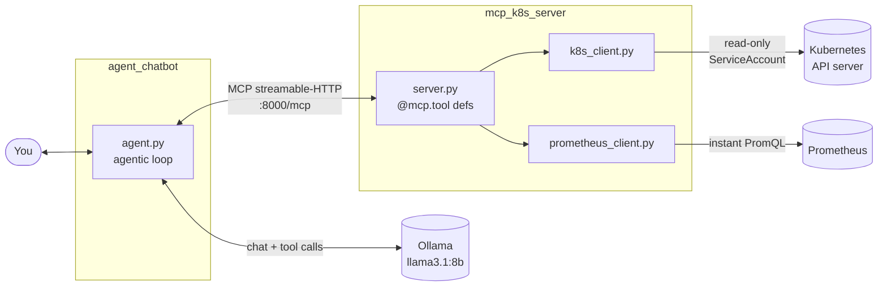
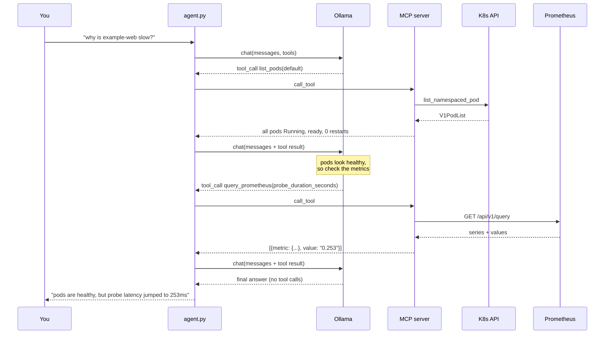

# k8s-agent-mcp


[](https://www.python.org/downloads/)
[](https://github.com/pre-commit/pre-commit)
[](https://github.com/spackle0/k8s-agent-mcp/actions/workflows/ci.yaml)
[](https://codecov.io/gh/spackle0/k8s-agent-mcp)

An agentic AI system for Kubernetes troubleshooting.

A local LLM reasons over a set of MCP tools that query a live cluster, so you
can ask "why is example-web slow?" instead of running six kubectl commands and
correlating the output yourself. Nothing leaves the machine: the model runs on
Ollama, the tools run against your own cluster, and a read-only RBAC role bounds
what the agent can see.

Everything here runs on a throwaway [k3d](https://k3d.io/) cluster you can
create in about a minute, so you can break things freely.

## Architecture

Two services communicate over MCP streamable-HTTP. The split matters: the MCP
server is the only component holding cluster credentials, and it exposes a
fixed, read-only vocabulary of tools. The agent has no cluster access at all.



The agent never talks to Kubernetes directly and the MCP server never talks to
the LLM. That boundary is what keeps the blast radius small: the worst a
misbehaving model can do is call a read-only tool with bad arguments.

### One conversation turn

The agent runs a loop rather than a single call. The model may chain several
tool calls before it has enough to answer, which is what makes this agentic
rather than a natural-language wrapper around kubectl. This example walks
through a latency problem, where the pod-level tools look healthy and only the
metrics reveal the fault:



## MCP tools

Tool docstrings are sent to the model as part of the tool definition, so they
are written for the model rather than for a human reader.

| Tool | Signature | Returns |
|---|---|---|
| `list_namespaces` | `() -> list[str]` | Namespace name strings |
| `list_pods` | `(namespace: str) -> list[dict]` | `name`, `phase`, `ready`, `restart_count`, `reason` |
| `read_pod_log` | `(namespace, pod, container=None, tail_lines=20) -> str` | Last N lines of container logs |
| `query_prometheus` | `(query: str) -> list[dict]` | `metric` labels, `value`, `timestamp` |

The design bias is toward tools that fetch data and let the model reason over
it. There is deliberately no `get_crashlooping_pods` tool, because `list_pods`
already returns enough for the model to work that out. A new tool earns its
place when it requires a different API call, not when it is a filter over data
you already have. `query_prometheus` qualifies: it is the only way to see
anything that pod status cannot express, latency being the obvious case.

## Prerequisites

- Python 3.14 and [uv](https://docs.astral.sh/uv/)
- [Docker](https://docs.docker.com/get-docker/) and [k3d](https://k3d.io/#installation)
- [Ollama](https://ollama.com/) with a tool-calling model pulled
- [helm](https://helm.sh/docs/intro/install/) and `kubectl`

## Quickstart

Copy the environment template and edit it for your setup. `.env` is gitignored:

```bash
cp .env.template .env
```

Create the cluster. This is a disposable 3-node k3d cluster defined in
[cluster.yaml](cluster.yaml), so deleting and recreating it costs about a
minute:

```bash
make cluster-create   # first time only
make cluster-start    # on subsequent boots
```

Pull the model and start Ollama in its own terminal:

```bash
make ollama
```

Start the MCP server and the agent together. The server runs in the background
and is killed when the agent exits:

```bash
make start
```

Then ask it something:

```
You: what namespaces are there?
You: are any pods unhealthy in default?
You: show me the last 50 lines from the example-web pod
```

Run `make` with no arguments for the full target list.

### Running against another cluster

Nothing here is k3d-specific. `k8s_client.py` tries in-cluster config first and
falls back to your kubeconfig, so any reachable cluster works: bare metal, a
managed cloud cluster, or anything else. Point your kubeconfig at it, skip the
`cluster-*` targets, and the rest of the quickstart is unchanged.

```bash
kubectl config current-context   # confirm before you start
```

## Cluster setup

### Read-only RBAC

When the MCP server runs inside the cluster it authenticates as a ServiceAccount
bound to a read-only ClusterRole. This is the security boundary that matters
most: `get`, `list`, and `watch` on namespaces, pods, events, and the `apps`
workload types, plus `get` on `pods/log`. No write verbs, anywhere.

```bash
kubectl apply -f deploy/rbac-readonly.yaml
```

Running the server outside the cluster with your own kubeconfig gives it your
permissions instead, which are almost certainly broader. That is fine for local
development against a throwaway cluster and a bad idea for anything else.

### Example workload

A small instrumented web app plus a Service and a ServiceMonitor, used as the
subject of the chaos experiments below:

```bash
kubectl apply -f deploy/workloads/test-workload.yaml
```

### Latency monitoring

The blackbox exporter probes the example workload every 5 seconds so you can
watch `probe_duration_seconds` move when latency is injected. Requires
Prometheus Operator in the cluster, and the Probe CR's `release: prometheus`
label must match your Prometheus Helm release name (check with `helm list -A`):

```bash
make blackbox-install
```

Useful PromQL once it is scraping, which you can hand straight to
`query_prometheus`:

```
probe_success{job="example-web-blackbox"}
probe_duration_seconds{job="example-web-blackbox"}
```

### Chaos experiments

[Chaos Mesh](https://chaos-mesh.org/) manifests that break the example workload
in specific, reversible ways. This is how you get real failures for the agent to
diagnose rather than inventing them:

```bash
kubectl apply -f deploy/chaosmesh/chaosmesh-pod-kill-cron.yaml      # pod killed on a cron
kubectl apply -f deploy/chaosmesh/chaosmesh-pod-cpu-stress.yaml     # 80% CPU load, 30s
kubectl apply -f deploy/chaosmesh/chaosmesh-network-delay.yaml      # 200ms +/- 50ms
kubectl apply -f deploy/chaosmesh/chaosmesg-pod-failure-5m.yaml     # pod failure, 5m
```

Each has a bounded `duration` and can be removed with `kubectl delete -f`.
Chaos Mesh needs its own RBAC, in [chaosmesh-rbac.yaml](deploy/chaosmesh/chaosmesh-rbac.yaml).

The pod-kill and pod-failure experiments show up in `list_pods` immediately. The
network delay is the interesting one: pod status stays completely healthy, and
only `query_prometheus` against `probe_duration_seconds` reveals it.

## Docker Compose

The `agent` service is interactive: the container keeps STDIN open and allocates
a TTY so you can type into the running Python process.

```bash
make compose-agent
```

Or run everything detached and open a shell in the agent container:

```bash
docker compose up -d
docker compose exec -it agent /bin/sh
python -m services.agent_chatbot.app.agent
```

To attach to the main agent process (only when started with a TTY):

```bash
docker compose ps
docker attach <container-name-or-id>
```

Detach without stopping the container with `Ctrl-p Ctrl-q`.

Compose mounts `${HOME}/.kube` read-only into the MCP server only. The agent
deliberately gets no kubeconfig: it reaches the cluster through the MCP server's
read-only tools, and giving it credentials would collapse that boundary. Because
a k3d kubeconfig points at `127.0.0.1`, which is unreachable from inside a
container, the `KUBECONFIG` env var selects a separate config file with a
routable API server address.

## Development

```bash
make test              # pytest across both service test directories
make lint              # ruff check
make format            # ruff format
make pre-commit-enable # install hooks into .git/hooks
```

Pre-commit runs ruff, whitespace and YAML/TOML checks, `detect-private-key`
(which is what stops a kubeconfig being committed by accident), and bandit over
`services/`. CI runs the test suite on push and PR to `main`.

## Configuration

Configuration lives in `.env`, which is gitignored. `.env.template` is
committed and holds every variable with a safe default. When you add a new
variable, add it to the template too.

| Variable | Default | Used by |
|---|---|---|
| `MCP_SERVER_URL` | `http://localhost:8000/mcp` | `agent.py` |
| `PROMETHEUS_URL` | `http://localhost:9090` | `prometheus_client.py` |
| `OLLAMA_HOST` | `http://localhost:11434` | ollama client (auto-detected) |

`PROMETHEUS_URL` assumes a port-forward to the Prometheus service:

```bash
kubectl -n monitoring port-forward svc/prometheus-operated 9090:9090
```

## Repository layout

```
services/
  mcp_k8s_server/    MCP server: tool definitions, K8s and Prometheus clients
  agent_chatbot/     Interactive chatbot and the agentic loop
deploy/
  rbac-readonly.yaml Read-only ClusterRole, binding, namespace, ServiceAccount
  workloads/         Example app, ServiceMonitor, blackbox Probe
  chaosmesh/         Fault injection experiments and their RBAC
docker/              Dockerfiles for both services
docs/                Longer-form writing and design notes
scripts/             Test runner used by CI
cluster.yaml         k3d cluster definition
ideas.md             Roadmap scratchpad
```

## License

See [LICENSE](LICENSE).
